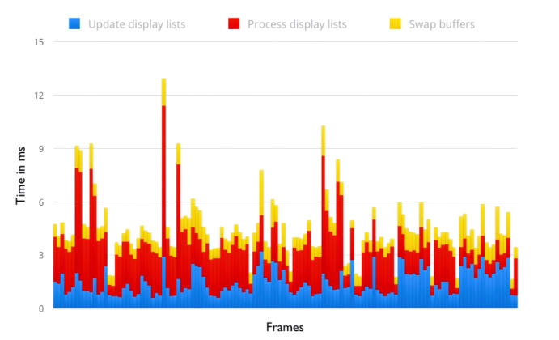

# AndroidShell (Mac Os Commands)

#### Table of Contents

- <a href="#sha1">__SHA-1__</a>
  - <a href="#debug_keystore">__Debug Keystore__</a>
  - <a href="#release_keystore">__Release Keystore__</a>
- <a href="#adb">__ADB__</a>
  - <a href="#server_actions">__Server actions__</a>
  - <a href="#show_cold_start_activity_time">__Show cold start Activity time__</a>
  - <a href="#database">__Database__</a>
  - <a href="#watching_strictmode">__Watching StrictMode__</a>
  - <a href="#view_connected_devices">__View connected devices__</a>
  - <a href="#list_running_services">__List of running services__</a>
  - <a href="#install_application">__Install an application__</a>
  - <a href="#uninstall_application">__Uninstall an application__</a>
  - <a href="#start_activity">__Start an Activity__</a>
  - <a href="#open_deep_linking_intent">__Open a deep linking intent__</a>
  - <a href="#take_screenshot">__Take an screenshot__</a>
  - <a href="#power_button">__Power button__</a>
  - <a href="#unlock_screen">__Unlock screen__</a>
  - <a href="#print_installed_packages">__Print all installed packages__</a>
  - <a href="#path_application">__Get the path of an installed application__</a>
  - <a href="#simulate_application_being_killed">__Simulate application being killed__</a>
  - <a href="#screen_recording_using_4_4">__Screen recording using Android 4.4__</a>
  - <a href="#check_battery_stats">__Check battery stats__</a>
  - <a href="#auto_backup_data_android_m">__Auto Backup Data (only in Android M)__</a>
  - <a href="#simulate_fingerprint_inputs_android_m">__Simulate fingerprint inputs (only in Android M)__</a>
  - <a href="#filter_tagname_logcat">__Filter by tagname in Logcat__</a>
  - <a href="#filter_priority_logcat">__Filter by priority in Logcat__</a>
  - <a href="#filter_using_grep_logcat">__Filter using grep in Logcat__</a>
  - <a href="#see_executed_sql_statements_plain_text_logcat">__See the executed SQL statements in plain text in Logcat__</a>
  - <a href="#execute_monkey_test_user_interaction">__Testing - Execute Monkey to test user interaction__</a>
  - <a href="#find_out_processor_version_android">__Find out processor version on Android Device (check if it's an ARM, for example)__</a>
  - [__Test Alarms__](#test-alarms)
  - [__Query a Content Provider__](#query-a-content-provider)
 - <a href="#find_out_abi">__Find out Application Binary Interface (ABI) in different devices__</a>
 - <a href="#retrieve_app_private_data_and_db_without_root">__Retrieve application's private data and databases for non debug application without root access__</a>
 - <a href="#identify_frame_rate_issues">__Indentify Frame Rate Issues (Dumpsys)__</a>
 - <a href="#adb_over_wifi">__Use ADB over Wi-Fi without extra application or software__</a>
 - <a href="#test_new_marshmallow_permissions">__Test new Marshmallow permissions__</a>
 - <a href="#test_app_with_app_standby">__Testing your app with App Standby__</a>
 - <a href="#test_app_doze">__Testing your app with Doze__</a>
 - <a href="#enabling_night_mode_android_nougat">__Enabling Night Mode on Android Nougat__</a>
 - [__Copy files from/to a device/emulator__](#copy-files-emulator)
- <a href="#aapt">__AAPT__</a>
  - <a href="#check_permissions_avoid_play_store_app_filtering">__Check Permissions in order to avoid Play Store app filtering__</a>

<br>

<a name="sha1">
### SHA-1
In order to get SHA1 to use it in many services, like Google+ Sign In, Maps, In app purchases, we should generate keys for every keystore (certificate):

<a name="debug_keystore">
#### Debug KeyStore
```sh
$ keytool -list -v -keystore ~/.android/debug.keystore -alias androiddebugkey -storepass android -keypass android
```
or

```sh
$ keytool -list -v -keystore {path_to_keystore}/debug.keystore -alias androiddebugkey -storepass android -keypass android
```

<a name="release_keystore">
#### Release KeyStore
```sh
$ keytool -list -v -keystore {path_to_keystore}/my-release.keystore -alias {alias_name} -storepass {store_pass} -keypass {keypass}
```

<br>

<a name="adb">
### ADB

<a name="server_actions">
#### Server actions

The following command kills the adb server:
```sh
adb kill-server 
```

This starts the adb server:
```sh
adb start-server
```

<a name="show_cold_start_activity_time">
#### Show cold start Activity time

```sh
$ adb logcat | grep "ActivityManager"
```

The output would be something similar to:
```
ActivityManager: Displayed com.example.launchtime/.LaunchTime: +666ms
```

<a name="database">
#### Database

[__This__](https://gist.github.com/ignasi) is a Database getter script, developed by [__Ignasi__](https://github.com/ignasi)
```sh
#!/bin/bash

# android 4.3+ changes app's internal directory permissions and you can not just pull your
# databases to your computer, so this is a workaround to extract your databases.
# I only use it for debug, use it under YOUR responsability. IT REQUIRES ROOT

package=$1
db_name=$2
path="/data/data/$package/"

rm $db_name
adb shell "su -c 'cd $path; chmod -R 777 databases; exit'; exit"
adb pull $path/databases/$db_name
open $db_name
```

<a name="watching_strictmode">
#### Watching StrictMode

If you’re using `penaltyLog()`, the default, just run
```sh
$ adb logcat
```
and watch the terminal output. Any violations will be logged to your console, slightly rate-limited for duplicate elimination.

If you want to get fancier, turn on `penaltyDropbox()` and they’ll be written to the DropBoxManager, where you can extract them later with
```sh
$ adb shell dumpsys dropbox data_app_strictmode --print
```

<a name="view_connected_devices">
#### View connected device

```sh
$ adb devices
```

If multiple devices are attached, use `adb -s DEVICE_ID` to target a specific device

<a name="list_running_services">
#### List of running services

```sh
$ adb shell dumpsys activity services
```

<a name="install_application">
#### Install an application

```sh
$ adb install -r file.apk // (or com.package.name)
# optional -r argument reinstalls and keeps any data if the application is already installed on the device.
# optional -s argument installs the app on the SD card instead of the internal storage.
```

<a name="uninstall_application">
#### Uninstall an application

```sh
$ adb uninstall com.package.name
```

To uninstall the application using uninstall dialog:
```sh
$ adb shell am start -a android.intent.action.DELETE -d package:com.package.name
```

To keep the data in the cache directory, add `-k`

```sh
$ adb uninstall -k com.package.name
```

<a name="start_activity">
#### Start an Activity

```sh
$ adb shell am start -n com.package.name/.ActivityName
$ adb shell am start -n com.package.name/com.package.name.ActivityName
```

<a name="open_deep_linking_intent">
#### Open a deep linking intent

```sh
$ adb shell am start -n android.intent.action.VIEW -d "scheme://app/deep/linking"
```

<a name="take_screenshot">
#### Take an screenshot

```sh
$ adb shell screencap -p | perl -pe 's/\x0D\x0A/\x0A/g' > screen_name.png
```

Explanation of this command, [__here__](http://blog.shvetsov.com/2013/02/grab-android-screenshot-to-computer-via.html)

<a name="power_button">
#### Power button

This command sends the power button event to turn the device ON/OFF.
```sh
$ adb shell input keyevent 26
$ adb shell inout text "KEYCODE_POWER"
```

<a name="unlock_screen">
#### Unlock screen

This command sends the event that unlocks the lockscreen on the device. It can be combined with the power button command above to turn on and unlock the device

```sh
$ adb shell input keyevent 82
$ adb shell inout text "KEYCODE_MENU"

$ adb shell input keyevent 26 82
$ adb shell inout text "KEYCODE_POWER" "KEYCODE_MENU"
```

<a name="print_installed_packages">
#### Print all installed packages

```sh
$ adb shell pm list packages -f
```

<a name="path_application">
#### Get the path of an installed application

```sh
$ adb shell pm path app.package.application-name
```

<a name="simulate_application_being_killed">
#### Simulate application being killed

```sh
# exit your app using home button
# After that.
$ adb shell ps // Find the process id
$ adb shell ps | grep your.app.package // Then find the line with app name package
$ adb shell kill -9 21997 // Kill the app by PID
# Now return to the app using the task switcher.
```

<a name="screen_recording_using_4_4">
#### Screen recording using Android 4.4

```sh
$ adb shell screenrecord --verbose /sdcard/nexus5.mp4 // Basic recording from shell
# Press Ctrl-C to stop.
$ screenrecord --verbose --time-limit 30 /sdcard/nexus5.mp4 // Recording for 30 seconds
$ screenrecord --verbose --bit-rate 8000000 --time-limit 30 /sdcard/nexus5.mp4 // Recording for 30 seconds with 8Mbps bitrate
$ screenrecord --verbose --rotate /sdcard/nexus5.mp4 // Record in portrait view / horizontal
```

<a name="check_battery_stats">
#### Check battery stats

```sh
$ adb shell dumpsys batterystats
# Global and per-UID statistics.
# Options: --help.
```

<a name="auto_backup_data_android_m">
#### Auto Backup Data (only in Android M)

```sh
$ adb shell bmgr

$ adb shell bmgr run
# Do some work in the app.
$ adb shell bmgr fullbackup com.domain.android.app_name
# Uninstall and reinstall the app.
$ adb shell bmgr restore com.domain.android.app_name
```

<a name="simulate_fingerprint_inputs_android_m">
#### Simulate fingerprint inputs (only in Android M)

```sh
$ adb -e emu finger touch 1
```

<a name="filter_tagname_logcat">
#### Filter by tagname in Logcat

```sh
$ adb logcat -s TAG_NAME
$ adb logcat -s TAG_NAME_1 TAG_NAME_2
```

<a name="filter_priority_logcat">
#### Filter by priority in Logcat

```sh
$ adb logcat "*:<priority>"
# Where <priority> can be V (Verbose), D (Debug), I (Info), W (Warning), E (Error), F (Fatal), S (Silent).
```

It can be combined with tagname command, to filter by tagname and priority
```sh
$ adb logcat -s TEST: W
```

<a name="filter_using_grep_logcat">
#### Filter using grep in Logcat

```sh
$ adb logcat | grep "term"
$ adb logcat | grep "term1\|term2"
````

<a name="see_executed_sql_statements_plain_text_logcat">
#### See the executed SQL statements in plain text in Logcat

```sh
$ adb shell setprop log.tag.SQLiteLog V
$ adb shell setprop log.tag.SQLiteStatements V
$ adb shell stop
$ adb shell start
```

That's it. Whenever any of the installed apps now accesses the database you should see the executed statement in the log output.

<a name="execute_monkey_test_user_interaction">
#### Testing - Execute Monkey to test user interaction

The Monkey is a program that runs on your emulator or device and generates pseudo-random streams of user events such as clicks, touches, or gestures, as well as a number of system-level events. You can use the Monkey to stress-test applications that you are developing, in a random yet repeatable manner.

```sh
$ adb shell monkey [options] <event-count>
# Basic, make 500 random actions.
$ adb shell monkey -p your.package.name -v 500
```

Complete information at http://developer.android.com/tools/help/monkey.html

<a name="find_out_processor_version_android">
#### Find out processor version on Android Device (check if it's an ARM, for example)

```sh
$ adb shell cat /proc/cpuinfo
```

#### Test Alarms

[__Source__](http://vitovalov.com/2016/07/18/adb-date-changer.html)

To check the alarms that are set on the connected device and to know more about them:

```shell
$ adb shell dumpsys alarm
```

To see the alarms from you app you can grep with your package keywords:
```shell
$ adb shell dumpsys alarm | grep -A 3 google
```

So now you can see if you have correctly implemented your alarms functionality using AlarmManager API.

[__More info here__](http://vitovalov.com/2016/07/18/adb-date-changer.html)

#### Query a Content Provider

```shell
$ adb shell content query --uri content://your.package.name --projection name
```

<a name="find_out_abi">
#### Find out Application Binary Interface (ABI) in different devices

__ABI__ (Application Binary Interface) is gonna tell us if an Android device support 64-bit. So using the next command the developer know if the device is __32-bit__ or __64-bit__ based.
```sh
$ adb shell getprop ro.product.cpu.abi\
```

<a name="retrieve_app_private_data_and_db_without_root">
#### Retrieve application's private data and databases for non debug application without root access

```sh
# Get a backup of your application data.
$ adb backup --apk com.package.name
# Change the .ab in .tar.
$ dd if=backup.ab bs=24 skip=1 | openssl zlib -d > backup.tar
# Untar  backup.tar.
tar xfv backup.tar
# Go in you app private dir.
$ cd apps/com.package.name
```
> You'll need :
> - adb activated
> - physical access to unlocked device
> - works on Nexus 5 at least, might not work with other devices.
> __allowBackup=false will break thos method__

<a name="identify_frame_rate_issues">
#### Indentify Frame Rate Issues (Dumpsys)

```sh
$ cd platform-tools/
# Before executing next command, go to Settings --> Developer Options --> Enable Profile GPU rendering option.
# And make sure to kill your application first or at least to kill the window that you want to profile, and then you run the command:
$ adb shell dumpsys gfxinfo
```
Purpose of Dumpsys is identifying frame rate issues and fix them.

What matter is the three columns shown. Copy paste results in a spreadsheet. And you will get a result like this one:



This is the data you can grab. You can create a stack graph, so every bar contains the sum of the three columns on the left in the data we output. Is the time it takes to update the display list on every frame.

* The middle column is called process display list. It's the time we take to draw the actual display list
* The last column is the time we take to swap the buffers, so to give the buffer back to surface flinger. Scrolling or doing any kind of actions should be below 16 millisecond limit. So this app is running at 60FPS, we're vsync'd, everything is going great. You can see that most of the time, you should spend most of the time in process display list, so drawing, executing the display list should be where you spend the bulk of the time.
* The blue part is your code. When you write your Java code, your `onDraw()` method, and this is where you can do most of the optimizations

There is a distinction between the GPU composition with frame buffers and overlays. So you can use a tool called __dumpsys surface flinger__ to see the state of overlays and frame buffers in the system.
```sh
$ adb shell dumpsys SurfaceFlinger
```

You're going to get a list with all the windows currently visible on the screen.

More info about this tool, [__here__](https://www.youtube.com/watch?v=Q8m9sHdyXnE#t=2469)

<a name="adb_over_wifi">
#### Use ADB over Wi-Fi without extra application or software

__Prerequisites__
Android device and computer should be connected in same network.  
* Connect Android device with USB cable to computer
* Use following command in terminal to make sure adb is running in USB mode.
```sh
$ adb usb
# Restarting in USB mode.
# Connect to the device over USB.
```

* Execute following command in terminal to make sure adb identify/list gets connected with the device.
```sh
$ adb devices
```

* Change adb mode from USB to tcpip using following command.
```sh
$ adb tcpip 5555
# Restarting in TCP mode port: 5555.
```

* Now, adb is running over TCP/IP mode, Let’s find IP address of Android device. Go to Settings in Android device -> About -> Status -> IP address. note down the IP address of connected Android Device.
* Use following command to connect ADB with IP address
```sh
$ adb connect #.#.#.#
# Connected to #.#.#.#:5555.
```

* Now adb is working over Wi-fi, You can remove USB cable from Android device.
* To confirm adb is working over Wi-fi and your device is still connect. you can use following command
```sh
$ adb devices
*.*.*.*:5555 device
```

You’re now ready to go!, Enjoy ADB over Wi-fi.
Use following command to change ADB mode to USB
```sh
$ adb usb
```

<a name="test_new_marshmallow_permissions">
#### Test new Marshmallow permissions

In order to test permissions targeting API 23+, we could use following commands to programatically grant and revoke permissions on the device:
```sh
$adb pm grant <package_name> <permission_name>
```
or
```sh
$adb pm revoke <package_name> <permission_name>
```

<br>

<a name="test_app_with_app_standby">
#### Testing your app with App Standby

[__Source__](http://developer.android.com/intl/ru/training/monitoring-device-state/doze-standby.html?utm_campaign=android_series_appstandby_012116&utm_source=medium&utm_medium=blog#testing_your_app_with_app_standby)

To test the App Standby mode with your app:

- Configure a hardware device or virtual device with an Android 6.0 (API level 23) or higher system image.
- Connect the device to your development machine and install your app.
- Run your app and leave it active.
- Force the app into App Standby mode by running the following commands:
```sh
$ adb shell dumpsys battery unplug
$ adb shell am set-inactive <packageName> true
```

- Simulate waking your app using the following commands:
```sh
$ adb shell am set-inactive <packageName> false
$ adb shell am get-inactive <packageName>
```

- Observe the behavior of your app after waking it. Make sure the app recovers gracefully from standby mode. In particular, you should check if your app's Notifications and background jobs continue to function as expected.

<br>

<a name="test_app_doze">
#### Testing your app with Doze

[__Source__](http://developer.android.com/intl/ru/training/monitoring-device-state/doze-standby.html?utm_campaign=android_series_appstandby_012116&utm_source=medium&utm_medium=blog#testing_your_app_with_app_standby)

You can test Doze mode by following these steps:

- Configure a hardware device or virtual device with an Android 6.0 (API level 23) or higher system image.
- Connect the device to your development machine and install your app.
- Run your app and leave it active.
- Shut off the device screen. (The app remains active.)
- Force the system to cycle through Doze modes by running the following commands:
```java
$ adb shell dumpsys battery unplug
$ adb shell dumpsys deviceidle step
```

You may need to run the second command more than once. Repeat it until the device state changes to idle.

- Observe the behavior of your app after you reactivate the device. Make sure the app recovers gracefully when the device exits Doze.

<br>

<a name="enabling_night_mode_android_nougat">
#### Enabling Night Mode on Android Nougat

[__Source__](http://michaelevans.org/blog/2016/08/23/enabling-night-mode-on-android-nougat/)
```
$ adb -d shell am start --ez show_night_mode true com.android.systemui/.tuner.TunerActivity
```

<br>

<a name="copy-files-emulator">
##### Copy files from/to a device/emulator

[__Source__](http://crushingcode.co/do-you-like-to-adb/)

To push a file/dir to device:
```sh
$ adb push <local> <remote>
```
where `<local>` is file in your local system i.e my_image.png and `<remote>` is file location in device/emulator i.e `/sdcard/Downloads/my_image.png`

Sample:
```sh
$ adb push ~/Downloads/my_image.png /sdcard/Downloads/my_image.png
```
To pull a file/dir from device

```sh
$ adb pull <remote> [<local>]
```
where `<local>` is file in your local system i.e my_image.png and `<remote>` is file location in device/emulator i.e `/sdcard/Downloads/my_image.png`.

Sample:
```sh
adb pull /sdcard/Downloads/my_image.png my_image.png
```

<br>

<a name="aapt">
### AAPT

<a name="check_permissions_avoid_play_store_app_filtering">
#### Check Permissions in order to avoid Play Store app filtering

[__Source__](https://goo.gl/jpxeLO)

Certain permissions also imply certain features. Google Play uses these to filter out apps just as it would with explicit requirements. Developers should __NOT__ rely on this implicit behavior, they should always declare explicitly every feature their app needs.

__aapt__ allows us, among other things, to see the contents of an app’s manifest. This is not as easy as simply unpacking the apk and reading the manifest as you’ll find it’s in a binary format. Here is the result of running the SDK-provided aapt tool in its apk:
```sh
$ aapt dump badging com.your-app.apk
```
Output
```
package: name='com.germanwings.android' versionCode='3' versionName='1.0.2' sdkVersion:'10' targetSdkVersion:'17'
uses-permission:'android.permission.WRITE_EXTERNAL_STORAGE'
uses-permission:'android.permission.INTERNET'
uses-permission:'android.permission.ACCESS_FINE_LOCATION'
uses-permission:'android.permission.ACCESS_COARSE_LOCATION'
uses-permission:'com.germanwings.android.permission.C2D_MESSAGE'
uses-permission:'android.permission.ACCESS_LOCATION_EXTRA_COMMANDS'
uses-permission:'android.permission.INTERNET'
uses-permission:'android.permission.GET_ACCOUNTS'
uses-permission:'android.permission.WAKE_LOCK'
uses-permission:'android.permission.READ_PHONE_STATE'
uses-permission:'com.google.android.c2dm.permission.RECEIVE'
uses-permission:'android.permission.ACCESS_LOCATION_EXTRA_COMMANDS'
uses-permission:'android.permission.ACCESS_MOCK_LOCATION'
uses-permission:'android.permission.ACCESS_NETWORK_STATE'
uses-permission:'android.permission.ACCESS_GPS'
uses-permission:'android.permission.ACCESS_LOCATION'
uses-permission:'android.permission.READ_EXTERNAL_STORAGE'
application-label:'Germanwings'
application-icon-120:'res/drawable-ldpi/ic_launcher.png'
application-icon-160:'res/drawable-mdpi/ic_launcher.png'
application-icon-240:'res/drawable-hdpi/ic_launcher.png'
application-icon-320:'res/drawable-xhdpi/ic_launcher.png'
application: label='Germanwings' icon='res/drawable-mdpi/ic_launcher.png'
launchable-activity: name='com.germanwings.android.presentation.activity.DashboardActivity' label='Germanwings' icon=''
uses-feature:'android.hardware.location'
uses-implied-feature:'android.hardware.location','requested a location access permission'
uses-feature:'android.hardware.location.gps'
uses-implied-feature:'android.hardware.location.gps','requested android.permission.ACCESS_FINE_LOCATION permission'
uses-feature:'android.hardware.location.network'
uses-implied-feature:'android.hardware.location.network','requested android.permission.ACCESS_COURSE_LOCATION permission'
uses-feature:'android.hardware.touchscreen'
uses-implied-feature:'android.hardware.touchscreen','assumed you require a touch screen unless explicitly made optional'
uses-feature:'android.hardware.screen.portrait'
uses-implied-feature:'android.hardware.screen.portrait','one or more activities have specified a portrait orientation'
main
other-activities
other-receivers
other-services
supports-screens: 'small' 'normal' 'large' 'xlarge'
supports-any-density: 'true'
locales: '--_--'
densities: '120' '160' '240' '320'
```
